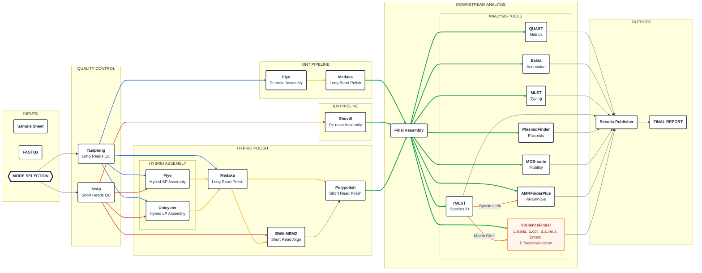

[!CAUTION] UNDER CONSTRUCTION > This pipeline is currently under active development. Features, parameters, and subworkflows are subject to change.

Overview

This Nextflow pipeline is designed for modular genomic analysis across multiple sequencing platforms. It supports automated database setup, quality control, assembly metrics, AMR (Antimicrobial Resistance) gene detection, and consolidated reporting.
Features

    Multi-Platform Support: Dedicated workflows for ONT, Illumina, and specialized protocols.

    Automated DB Management: Built-in routine to initialize and configure required databases (AMRFinder, Bakta, PlasmidFinder).

    Consolidated Reporting: Generates HTML summaries of AMR findings and comprehensive run reports.

